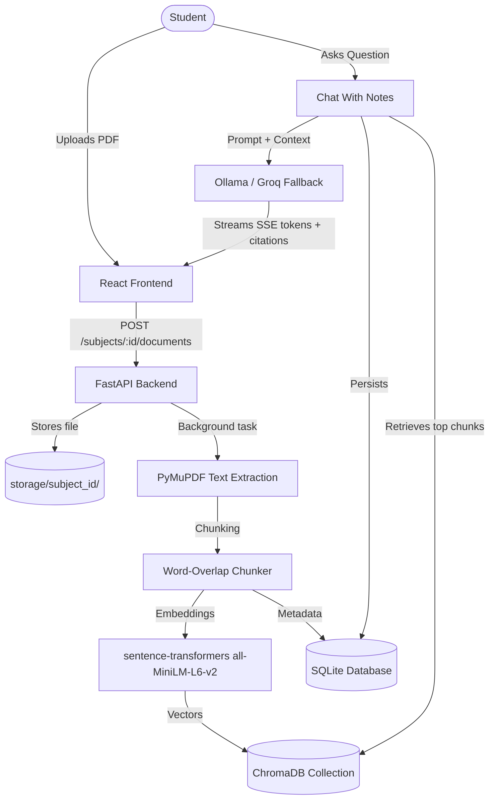
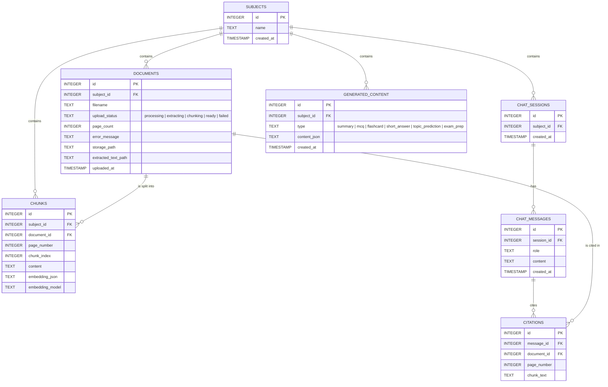

# 🚀 PageTurn AI - Local, Citation-First Study Assistant for Lecture PDFs

PageTurn AI is a **local, citation-first study assistant** for working with lecture PDFs. It lets a student create subjects, upload PDF notes, ask questions against those notes, generate study material, and export generated content with source citations. Built as a full-stack **RAG (Retrieval-Augmented Generation)** application, the core rule of the app is simple: answers and generated study content should be grounded in uploaded material, with filename/page citations surfaced to the user.

---

## 🏗️ System Architecture & Workflow

PageTurn is organized around **subjects** — top-level study workspaces that contain uploaded PDFs, chat sessions, and generated study content. There are no user roles or accounts; it is a single-user, local-first application.

### 🔄 Upload & Indexing Pipeline

```text
PDF upload
  -> PyMuPDF page-level text extraction
  -> word-overlap chunking
  -> sentence-transformers embeddings
  -> ChromaDB vector storage
  -> FastAPI retrieval and LLM prompts
  -> React UI with citations back to file/page
```



### 🔄 Chat Flow

1. The frontend calls `POST /subjects/{subject_id}/chat`.
2. The backend embeds the user question.
3. ChromaDB returns nearest chunks from that subject's collection.
4. Chroma cosine distance is converted to a similarity score with `1 - distance`.
5. The prompt is built with the retrieved context.
6. The backend tries Ollama first.
7. If Ollama fails, the backend tries Groq.
8. If both fail, the endpoint raises a visible runtime error (no silent fallback to raw chunks).
9. The answer streams back as SSE `token` events.
10. A final `citations` SSE event sends citation metadata.
11. The chat session, user message, assistant message, and citations are persisted.

### 🔄 Study Generation Flow

1. The frontend calls one of `POST /subjects/{subject_id}/generate`, `/predict-topics`, or `/exam-prep`.
2. The backend selects chunks — semantic retrieval for a topic, representative subject-wide chunks for broad generation, or exact selected chunk IDs for exam prep packs.
3. A JSON-only prompt is sent to the LLM.
4. The raw response is parsed with `json.loads`, markdown/code-fence stripping, and `json_repair`.
5. Items are normalized into frontend-friendly shapes.
6. Source chunk IDs are mapped back to real citations.
7. Hallucinated source chunk IDs are logged and skipped, not converted into fake citations.
8. The generated content is stored as JSON in `generated_content`.

### 🗄️ Database Schema ERD



---

## 🛠️ Technology Stack

### Backend
- **Core Engine:** Python, FastAPI
- **Database & ORM:** SQLite, SQLAlchemy
- **PDF Processing:** PyMuPDF (page-level text extraction, PDF export rendering)
- **Vector Storage:** ChromaDB (one collection per subject)
- **Embeddings:** `sentence-transformers/all-MiniLM-L6-v2`
- **LLM Integration:** Ollama (primary), Groq (fallback), via `httpx`
- **Utilities:** `python-dotenv`, `json-repair` (robust JSON parsing from LLM output)

### Frontend
- **Framework & Build Tool:** React 18, Vite, TypeScript
- **Styling Engine:** Tailwind CSS (warm off-white/forest-green theme, dark mode)
- **Animation:** Framer Motion (transitions)
- **Icons & Fonts:** lucide-react, `@fontsource/inter`, `@fontsource/jetbrains-mono`

---

## 📂 Project Directory Structure

```
PageTurn-AI/
├── app/
│   ├── main.py                  # FastAPI app setup, CORS, route registration
│   ├── database.py              # SQLite engine, paths, session factory
│   ├── schemas.py                # Pydantic request/response models
│   ├── requirements.txt          # Backend Python dependencies
│   ├── models/
│   │   ├── subject.py            # Subject model
│   │   ├── document.py           # Document model
│   │   ├── chunk.py               # Chunk model
│   │   ├── chat.py                # ChatSession, ChatMessage, Citation models
│   │   └── generated_content.py   # GeneratedContent model
│   ├── routers/
│   │   ├── health.py              # Health and LLM settings endpoints
│   │   ├── subjects.py            # Main subject/document/chat/generation API
│   │   └── admin.py               # Global cleanup endpoints
│   └── services/
│       ├── pdf_processing.py       # PDF extraction and indexing entry point
│       ├── chunking.py             # Word-overlap chunking
│       ├── embedding.py            # sentence-transformers embeddings
│       ├── indexing.py             # ChromaDB indexing/retrieval/migration
│       ├── llm.py                  # Ollama/Groq answer generation
│       ├── generation.py           # Study content and exam prep generation
│       └── export.py               # Markdown/PDF export
│
├── frontend/
│   ├── index.html                # App shell and favicon links
│   ├── package.json               # Frontend dependencies and scripts
│   ├── vite.config.ts             # Vite config
│   ├── tailwind.config.ts         # Tailwind theme tokens
│   ├── src/
│   │   ├── main.tsx                # React entry point and font imports
│   │   ├── index.css               # CSS variables and global styles
│   │   ├── App.tsx                 # Main SPA, routes, screens, viewers
│   │   ├── lib/api.ts               # Typed frontend API client
│   │   └── components/Logo.tsx      # SVG logo mark and wordmark
│   └── public/                     # favicon.svg, favicon-32.png, favicon.ico, apple-touch-icon.png, site.webmanifest
│
├── data/
│   ├── pageturn.db                # Main SQLite database, created locally
│   └── chroma/                     # ChromaDB persistent vector store
│
├── storage/
│   └── {subject_id}/                # Uploaded PDFs and extracted text
│
└── Project_Specification.md        # Original phased project specification
```

---

## 🚀 Installation & Local Setup

Instructions assume **Windows PowerShell** from the project root.

### Prerequisites
- **Python** (with `venv` support)
- **Node.js** (for the Vite/React frontend)
- **Ollama** running locally (for the primary LLM provider)
- **Groq API Key** (optional, enables fallback if Ollama is unavailable)

### Step 1: Create and Activate a Virtual Environment
```powershell
python -m venv .venv
.\.venv\Scripts\Activate.ps1
python -m pip install --upgrade pip
```

### Step 2: Install Backend Dependencies
```powershell
pip install -r app\requirements.txt
```

### Step 3: Install Frontend Dependencies
```powershell
cd frontend
npm install
cd ..
```

### Step 4: Configure Environment Variables
Create a root `.env` file:
```env
OLLAMA_HOST=http://127.0.0.1:11434
OLLAMA_MODEL=qwen2.5:1.5b
GROQ_API_KEY=
GROQ_MODEL=llama-3.1-8b-instant
```

For a fully local setup, pull the configured Ollama model:
```powershell
ollama pull qwen2.5:1.5b
```

### Step 5: Cache the Embedding Model
The embedding service loads `all-MiniLM-L6-v2` with `local_files_only=True`, so it must be cached before first use. On a machine with network access, run:
```powershell
python -c "from sentence_transformers import SentenceTransformer; SentenceTransformer('all-MiniLM-L6-v2')"
```

### Step 6: Run the Backend
```powershell
.\.venv\Scripts\Activate.ps1
uvicorn app.main:app --reload --host 127.0.0.1 --port 8000
```
Backend URL: `http://127.0.0.1:8000` — API docs: `http://127.0.0.1:8000/docs`

### Step 7: Run the Frontend
```powershell
cd frontend
npm run dev
```
Open [http://127.0.0.1:5173](http://127.0.0.1:5173) in your web browser.

*Note: If needed, create `frontend/.env` with `VITE_API_BASE_URL=http://127.0.0.1:8000`.*

---

## 📡 API Endpoint Reference

### Health and Settings
| HTTP Method | Endpoint | Access Level | Description |
| :--- | :--- | :--- | :--- |
| **GET** | `/health` | Public | Backend health check |
| **GET** | `/settings/llm` | Public | Read-only LLM provider configuration |

### Dashboard and Subjects
| HTTP Method | Endpoint | Access Level | Description |
| :--- | :--- | :--- | :--- |
| **GET** | `/subjects/dashboard/stats` | Public | Counts for subjects, documents, chats, generated sets |
| **GET** | `/subjects` | Public | List subjects with document counts |
| **POST** | `/subjects` | Public | Create a subject |
| **PATCH** | `/subjects/:subject_id` | Public | Rename a subject |
| **DELETE** | `/subjects/:subject_id` | Public | Delete a subject and all associated data |

### Documents
| HTTP Method | Endpoint | Access Level | Description |
| :--- | :--- | :--- | :--- |
| **POST** | `/subjects/:subject_id/documents` | Public | Upload a PDF |
| **GET** | `/subjects/:subject_id/documents` | Public | List documents for a subject |
| **DELETE** | `/subjects/:subject_id/documents/:document_id` | Public | Delete one document/PDF |
| **GET** | `/subjects/document-files/:document_id` | Public | Serve a PDF file for citation viewing |

### Chat
| HTTP Method | Endpoint | Access Level | Description |
| :--- | :--- | :--- | :--- |
| **POST** | `/subjects/:subject_id/chat` | Public | Ask a question and stream the answer (SSE) |
| **GET** | `/subjects/:subject_id/chat/history` | Public | List saved chat sessions |
| **DELETE** | `/subjects/:subject_id/chat/sessions/:session_id` | Public | Delete one chat session |
| **DELETE** | `/subjects/:subject_id/chat/sessions/all` | Public | Delete all chat sessions for one subject |

### Generated Content
| HTTP Method | Endpoint | Access Level | Description |
| :--- | :--- | :--- | :--- |
| **GET** | `/subjects/:subject_id/generated` | Public | List generated content for one subject |
| **GET** | `/subjects/generated/all` | Public | List generated content across all subjects |
| **POST** | `/subjects/:subject_id/generate` | Public | Generate summary, MCQs, flashcards, or short/long questions |
| **POST** | `/subjects/:subject_id/predict-topics` | Public | Generate predicted important topics |
| **POST** | `/subjects/:subject_id/exam-prep` | Public | Generate a combined exam prep pack |
| **GET** | `/subjects/:subject_id/export/:content_id?format=markdown` | Public | Export generated content as Markdown |
| **GET** | `/subjects/:subject_id/export/:content_id?format=pdf` | Public | Export generated content as PDF |
| **DELETE** | `/subjects/:subject_id/generated/:content_id` | Public | Delete one generated item |
| **DELETE** | `/subjects/:subject_id/generated/all` | Public | Delete all generated content for one subject |

### Admin Cleanup
*These endpoints are intentionally destructive and unauthenticated — not meant for public exposure.*

| HTTP Method | Endpoint | Access Level | Description |
| :--- | :--- | :--- | :--- |
| **DELETE** | `/admin/subjects/all` | Local only | Delete every subject and all associated workspace data |
| **DELETE** | `/admin/chats/all` | Local only | Delete all chat sessions/messages/citations only |
| **DELETE** | `/admin/generated-content/all` | Local only | Delete all generated study sets only |

---

## ⚠️ Known Limitations
- OCR is not implemented — scanned PDFs without selectable text fail with a clear message.
- There is no authentication or multi-user separation.
- SQLite is used for local development, with no database migrations yet.
- Background processing uses FastAPI `BackgroundTasks`, not a durable queue.
- The embedding model requires local caching (`local_files_only=True`) before first use.
- The app is local-first and not currently packaged for production hosting.
- Admin cleanup endpoints are intentionally powerful and should not be exposed publicly without auth.

---

## 📄 License
Licensed under the MIT License.
